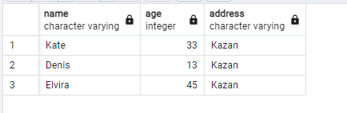

## Day 00

## Exercise 00 - First steps into SQL world
Please make a select statement which returns all person's names and person's ages from the city ‘Kazan’.

```sql
select name, age, address  
from persons    
here address = 'Kazan'
```

