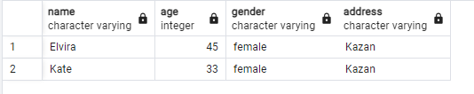

## DAY 01

## Exercise 01 - First steps into SQL world

Please make a select statement which returns names , ages for all women from the city ‘Kazan’. Yep, and please sort result by name.

```sql
select name, age, gender, address
from person
where gender = 'female' AND address = 'Kazan'
order by name
```
