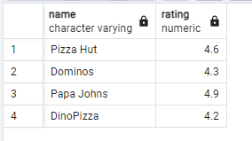

## Day 02

## Exercise 02 - First steps into SQL world

Please make 2 syntax different select statements which return a list of pizzerias (pizzeria name and rating) with rating between 3.5 and 5 points (including limit points) and ordered by pizzeria rating.
- the 1st select statement must contain comparison signs  (<=, >=)
- the 2nd select statement must contain `BETWEEN` keyword

```sql
select name, rating from pizzeria
where rating >= (3.5) and rating <= (5)
```

```sql
select name, rating from pizzeria
where rating  between 3.5 and 5
```
