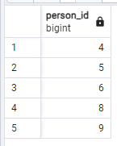

## Day03

## Exercise 03 - First steps into SQL world

Please make a select statement which returns the person's identifiers (without duplication) who visited pizzerias in a period from 6th of January 2022 to 9th of January 2022 (including all days) or visited pizzeria with identifier 2. Also include ordering clause by person identifier in descending mode.

```sql
select distinct person_id from person_visits pv
where pv.visit_date between '2022-01-06' and '2022-01-09'
```
