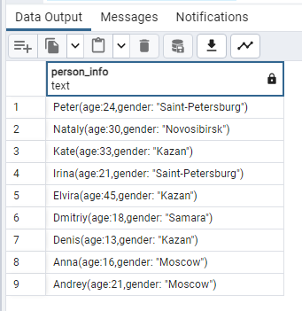

## Day04

## Exercise 04 - First steps into SQL world

Please make a select statement which returns one calculated field with name ‘person_information’ in one string like described in the next sample:

`Anna (age:16,gender:'female',address:'Moscow')`

Finally, please add the ordering clause by calculated column in ascending mode.
Please pay attention to quote symbols in your formula!

```sql
select 
	CONCAT(person.name, '(age:', person.age, ',gender: "', address, '")') as person_info 
from person
order by person_info desc
```
