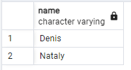

## Day05

## Exercise 05 - First steps into SQL world

Please make a select statement which returns person's names (based on internal query in `SELECT` clause) who made orders for the menu with identifiers 13 , 14 and 18 and date of orders should be equal 7th of January 2022. Be aware with "Denied Section" before your work.

Please take a look at the pattern of internal query.

    SELECT 
	    (SELECT ... ) AS NAME  -- this is an internal query in a main SELECT clause
    FROM ...
    WHERE ...

```sql
select name from person
where person.id IN (
	select person_id
	from person_order 
	where menu_id in (13, 14, 18) and order_date = '2022-01-07')
```
