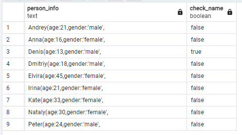

## Day06

## Exercise 06 - First steps into SQL world

Please use SQL construction from Exercise 05 and add a new calculated column (use column's name ‘check_name’) with a check statement (a pseudo code for this check is presented below) in the `SELECT` clause.

    if (person_name == 'Denis') then return true
        else return false

```sql
select 
	concat (name, '(age:', age, ',gender:''', gender, ''',
		   address:''',address ,''')') as person_info,	
		   case 
		   	when name = 'Denis' then true
			else false
			end as check_name
		from
			person
		order by person_info asc;
```
