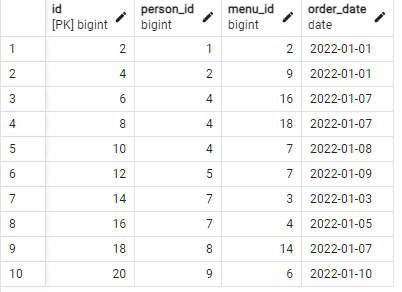

## day08

## Exercise 08 - First steps into SQL world

Please make a SQL statement which returns all columns from the `person_order` table with rows whose identifier is an even number. The result have to order by returned identifier.

```sql
SELECT *
FROM person_order
WHERE id % 2 = 0
ORDER BY id ASC;
```
